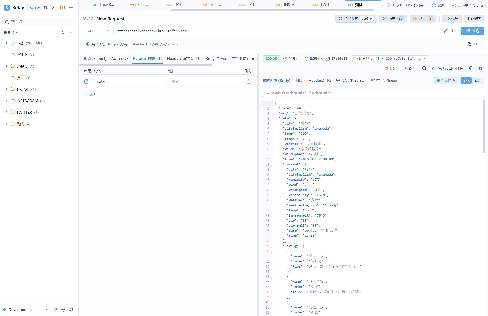
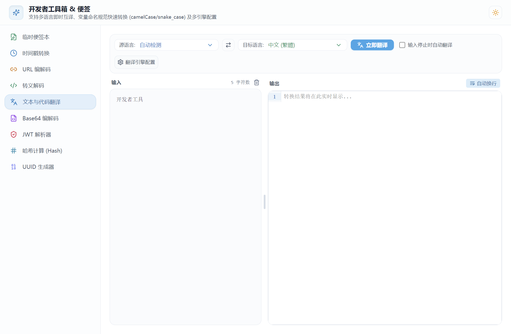
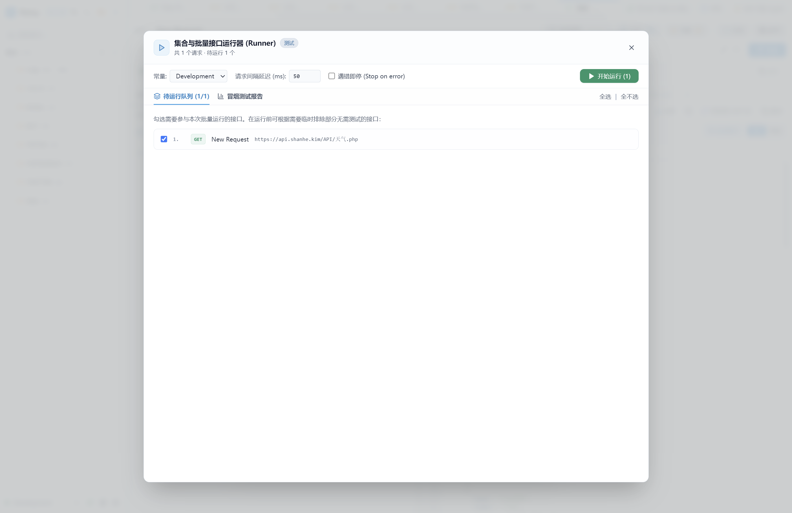
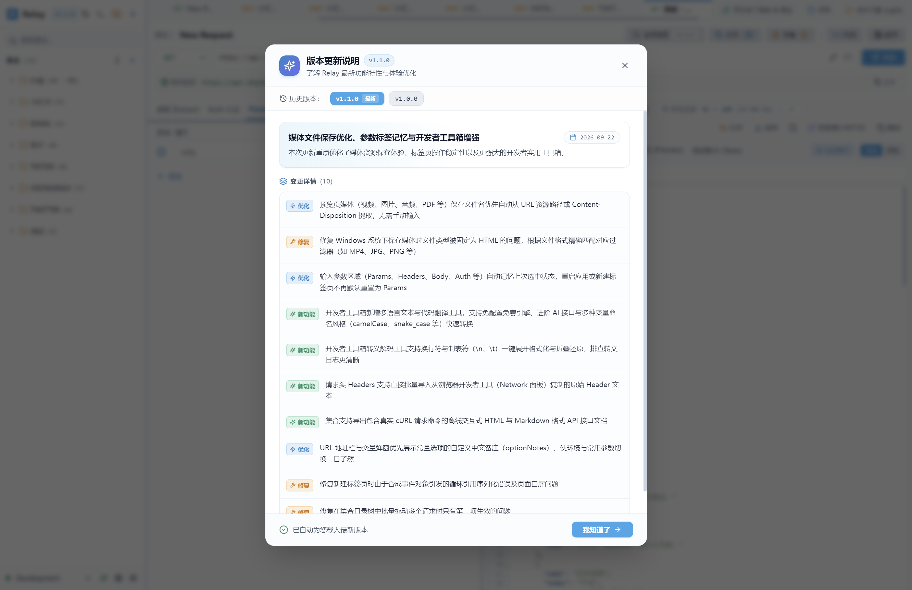

<div align="center">


# Relay

### 专为开发者打造的轻量、极速、无 CORS 拦截的高性能 API 客户端
### *A fast, lightweight, and clean API client built for developers*

[](./package.json)
[](https://www.electronjs.org/)
[](https://react.dev/)
[](https://www.typescriptlang.org/)
[](https://vitejs.dev/)
[](https://tailwindcss.com/)
[](./LICENSE)

<p align="center">
  <a href="#-为什么选择-relay">为什么选择 Relay</a> •
  <a href="#-核心亮点">核心亮点</a> •
  <a href="#-快捷键速查">快捷键速查</a> •
  <a href="#-快速开始">快速开始</a> •
  <a href="#-项目结构">项目结构</a> •
  <a href="#-更新日志">更新日志</a> •
  <a href="#-界面预览-screenshots">界面预览</a> •
  <a href="#-license">开源协议</a>
</p>

<p align="center">
  
</p>

</div>

---

## 💡 为什么选择 Relay？

市面上的传统 API 客户端（如 Postman、Insomnia 等）日益趋向于**体积臃肿、启动缓慢、强制绑定云端账号、收集隐私遥测**。而在浏览器环境下的轻量工具又受制于**严格的 CORS 跨域策略**。

**Relay** 致力于重新回归 API 调试的本质：
- 🚀 **毫秒级冷启动**：极简现代架构，告别漫长转圈等待，随开随用。
- 🛡️ **纯本地离线优先**：无强制登录、无云端同步绑架、无数据埋点，所有配置与历史快照 100% 留存在本地。
- 🌐 **原生无 CORS 拦截**：底层依托 Electron 原生 Node.js 网络套接字，天然不受浏览器同源安全策略约束，接口随心调试。
- 💻 **沉浸式开发者体验**：现代化多标签流、双向可拖拽尺寸记忆分栏、支持 JSON 注释、内置开发者多功能工具箱。

---

## ✨ 核心亮点

### 1. ⚡ 原生无跨域请求内核
- 支持 `GET`、`POST`、`PUT`、`DELETE`、`PATCH`、`HEAD`、`OPTIONS` 全部 HTTP 方法。
- 无浏览器 CORS 限制，轻松请求任意域名、局域网 IP 与端口。
- 支持开启/关闭 SSL 证书校验（一键调通开发环境自签名 HTTPS 证书）。

### 2. 🧩 动态常量池与专属覆盖值 (Unique Feature)
- **全局动态常量**：在 URL、Headers、Params、Body 中自由使用 `{{variable}}` 占位符。
- **快捷候选值与中文备注**：每个常量可预设多个候选值（如本地 `127.0.0.1`、测试服 `192.168.1.100` 等），并在 URL 胶囊标签中直接下拉一键切换！
- **单请求专属覆盖值**：可在单个请求中重写指定常量，不污染全局配置，清晰直观。

### 3. 💬 原生支持 JSON 注释与自动格式化
- 在 Body 编辑器中原生支持 `// 单行注释` 与 `/* 多行注释 */`，排查复杂接口传参时可随时注释字段。
- **智能发包保护**：实际发送网络请求时，底层会自动剥离注释转换为标准 RFC JSON 传输，编辑器内原始注释保持完好无损。

### 4. 🖼️ 富媒体实时预览与智能文件导出
- 支持图片（JPG/PNG/GIF/WebP/SVG）、音视频（MP4/WebM/MP3/WAV）、PDF、HTML 文档实时渲染与交互。
- **智能文件名提取**：保存媒体时优先从下载 URL（路径最后一段或 `filename` 参数）及 `Content-Disposition` 提取真实文件名，不再使用标签名兜底。
- **系统文件过滤器**：自动适配 Windows 保存文件类型过滤器（如 `MP4 Video (*.mp4)`），杜绝误存为 HTML。

### 5. 📑 浏览器级多标签工作流与退出恢复
- 支持多标签页并发运行，未保存草稿标记醒目橙点保护。
- **退出与重启全自动状态记忆**：关闭软件或电脑重启后，自动恢复上次打开的所有标签页、活动标签、输入参数选中页（Params/Headers/Body）及未保存内容。

### 6. 🛠️ 内置开发者实用工具箱 (DevToys)
按快捷键 `Ctrl + Shift + T` 或点击顶部图标即可呼出独立/内嵌工具箱：
- 🕒 **时间戳转换**：Unix 时间戳（秒/毫秒）与格式化日期双向即时转换。
- 🔗 **URL 编解码**：URL Component 智能编解码。
- 🔤 **Base64 编解码**：文本、数据 Base64 转换。
- 🎫 **JWT 调试器**：Header 与 Payload 智能格式化解码，过期时间直观高亮。
- 🔒 **哈希散列计算**：MD5、SHA-1、SHA-256、SHA-512 实时生成。
- 🆔 **UUID 生成器**：批量生成 v4 UUID。
- 🔁 **转义/反转义**：代码与字符串反斜杠转义解码，支持 `\n` 与 `\t` 一键展开格式化与折叠压缩。
- 🌐 **多引擎文本与代码翻译**：免配置免费引擎、DeepL 与 AI 大模型多引擎切换，支持代码变量命名风格转换（camelCase、snake_case、PascalCase 等）。

### 7. 🏃 集合批量冒烟测试 (Collection Runner)
- 支持按目录或通过 Ctrl/Shift 多选重点接口进行一键批量串行回归测试。
- 提供可视化实时运行看板（总数、成功/失败率、总耗时、状态码分布柱状图）。
- 支持配置请求延迟间隔、遇到错误即停（Stop on error）与一键导出 JSON 测试报告。

### 8. 📄 离线 API 文档生成与多语言代码导出
- **离线接口文档**：集合一键导出为包含真实 `cURL` 请求命令的高颜值离线 HTML 或 Markdown 文档，便于团队分发归档。
- **客户端代码生成 (Code Snippets)**：一键将请求转化为 cURL、JavaScript (Fetch / Axios)、Python (Requests)、Go (net/http)、Java (OkHttp) 生产可用代码。
- **快速导入**：支持从浏览器 DevTools 一键粘贴导入原始 Headers，支持直接粘贴导入 cURL 命令。

### 9. 🎨 布局自由拖拽与双主题
- 侧边栏宽度支持自由拖拽（180px ~ 600px），请求/响应区域分栏比例自由滑动调节，窗口尺寸全局记忆。
- 完整支持深色暗夜模式（Dark）与清爽明亮模式（Light），中英文双语界面无缝切换。

---

## 📷 界面预览 (Screenshots)

### 1. 主工作区与请求调试
多标签页切换、URL 动态变量胶囊下拉切换、支持 JSON 注释的请求体编辑器与右侧高亮响应面板：
<p align="center">
  
</p>

### 2. 内置开发者实用工具箱 (DevToys)
集成临时便签、时间戳、URL 编解码、转义解码、多引擎文本与代码变量翻译、Base64、JWT 与哈希计算：
<p align="center">
  
</p>

### 3. 集合冒烟测试与批量运行器 (Collection Runner)
一键装载集合全量接口或多选重点接口，配置请求间隔与遇错即停，全自动测试：
<p align="center">
  
</p>

### 4. 版本更新说明 (What's New)
版本升级自动提醒，按新功能、优化、修复分类展示，支持随时回溯历史版本记录：
<p align="center">
  
</p>

---

## ⌨️ 快捷键速查

| 快捷键 | 功能说明 | 使用场景 |
| :--- | :--- | :--- |
| <kbd>Ctrl</kbd> + <kbd>Enter</kbd> | **发送当前请求** | 在任意输入框时光标无需离开直接发包 |
| <kbd>Ctrl</kbd> + <kbd>S</kbd> | **保存当前请求** | 将当前参数修改持久化写回集合树 |
| <kbd>Ctrl</kbd> + <kbd>P</kbd> | **全局快速检索 (Quick Open)** | 模糊搜索接口名、URL、方法或集合目录 |
| <kbd>Ctrl</kbd> + <kbd>T</kbd> | **新建请求标签页** | 快速开启一个空白就绪的接口测试标签 |
| <kbd>Ctrl</kbd> + <kbd>W</kbd> | **关闭当前标签页** | 关闭正在浏览的标签页 |
| <kbd>Ctrl</kbd> + <kbd>D</kbd> | **快速克隆请求** | 一键复制当前接口与其完整配置 |
| <kbd>Ctrl</kbd> + <kbd>Shift</kbd> + <kbd>T</kbd> | **呼出开发者工具箱** | 打开时间戳、Base64、JWT、翻译等实用工具 |
| <kbd>Ctrl</kbd> + <kbd>,</kbd> | **打开设置中心** | 调出首选项、快捷键列表与关于界面 |

---

## 🛠️ 技术栈

- **桌面运行时**：[Electron 33](https://www.electronjs.org/) (Node.js 20 集成网络内核)
- **前端视图**：[React 18](https://react.dev/) + [TypeScript 5](https://www.typescriptlang.org/)
- **构建工程**：[electron-vite 2](https://electron-vite.org/) + [Vite 5](https://vitejs.dev/)
- **样　　式**：[Tailwind CSS 3](https://tailwindcss.com/)
- **代码编辑器**：[@uiw/react-codemirror](https://uiwjs.github.io/react-codemirror/) (带 JSON/JS 语法着色与搜索)
- **图　　标**：[Lucide React](https://lucide.dev/)
- **打包分发**：[electron-builder](https://www.electron.build/) (LZMA2 高压缩率 NSIS 安装包)

---

## 🚀 快速开始

### 准备工作
确保已安装 [Node.js](https://nodejs.org/) (推荐版本 `>= 18.0.0`) 与 npm。

### 1. 克隆代码仓库
```bash
git clone https://github.com/Yokia/relay.git
cd relay
```

### 2. 安装项目依赖
```bash
npm install
```

### 3. 启动开发模式
```bash
npm run dev
```
此命令将同时启动主进程热重载与渲染进程 Vite HMR，启动后即可在桌面端实时预览和调试。

### 4. 编译与打包

#### 标准构建打包
```bash
npm run build
```

#### 构建 Windows 安装包 (.exe)
```bash
npm run build:win
```
或直接双击运行项目根目录下的 `build-win.bat` 批处理脚本，生成的安装程序位于 `dist/` 目录下。

---

## 📂 项目结构

```text
Relay/
├── resources/                 # 应用程序图标与打包静态资源 (icon.ico, icon.png)
├── src/
│   ├── main/                  # Electron 主进程源码
│   │   ├── index.ts           # 主窗口创建、生命周期与所有 IPC 桥接通道
│   │   ├── httpService.ts     # Node.js 原生底层 HTTP/HTTPS 请求执行引擎
│   │   └── storage.ts         # 本地 JSON 数据持久化引擎
│   ├── preload/               # 预加载脚本 (安全暴露 window.electronAPI)
│   │   └── index.ts
│   └── renderer/              # React 前端渲染进程源码
│       ├── src/
│       │   ├── components/    # 核心 UI 组件
│       │   │   ├── RequestEditor.tsx        # 请求参数编辑器 (Params/Headers/Body/Auth)
│       │   │   ├── ResponseViewer.tsx       # 响应查看面板 (Pretty/Raw/Preview/Headers)
│       │   │   ├── Sidebar.tsx              # 集合树导航、常量切换与历史记录
│       │   │   ├── TabBar.tsx               # 浏览器风格多标签页栏
│       │   │   ├── DevToysModal.tsx         # 内置开发者工具箱 (9合1工具)
│       │   │   ├── CollectionRunnerModal.tsx# 集合自动化批量运行器
│       │   │   ├── ChangelogModal.tsx       # 版本更新说明弹窗
│       │   │   └── SettingsModal.tsx        # 应用首选项与关于窗口
│       │   ├── data/
│       │   │   └── changelog.ts             # 集中化版本号与更新日志数据源
│       │   ├── i18n/          # 中英文完整双语字典与帮助中心文档
│       │   ├── utils/         # 辅助工具库 (cURL解析、文件导出、集合树、JSONPath 等)
│       │   └── types.ts       # 全局 TypeScript 接口定义
├── electron.vite.config.ts    # electron-vite 构建配置
├── package.json
└── tailwind.config.js
```

---

## 📝 更新日志

请查阅应用内关于面板的 **版本更新说明** 或查看源码 [`src/renderer/src/data/changelog.ts`](./src/renderer/src/data/changelog.ts)。

- **v1.1.0** (2026-09-22)
  - 优化预览页媒体（视频、图片、音频、PDF）保存文件名提取逻辑，优先从 URL / Content-Disposition 解析。
  - 修复 Windows 保存文件对话框媒体类型过滤器问题。
  - 输入参数区域（Params/Headers/Body等）支持记住上次选中的标签页。
  - 开发者工具箱新增多引擎文本/代码翻译及变量风格转换工具。
  - 转义工具支持换行符 `\n` 与制表符 `\t` 一键展开格式化与折叠压缩。
  - 支持从浏览器 DevTools 一键批量粘贴导入 Headers。
  - 集合支持生成包含真实 cURL 命令的离线 HTML / Markdown 接口文档。
  - 修复新建标签页白屏及批量拖动请求等异常。
- **v1.0.0** (2026-09-18)
  - Relay 首发正式版：轻量、极速的高性能本地 API 客户端。

---

## 📄 License

本项目基于 [MIT License](./LICENSE) 协议开源。欢迎提交 Issue 或 Pull Request 为 Relay 添砖加瓦！

---

<div align="center">
  <b>Relay</b> · Made with ❤️ for developers by yokiasoft.
</div>
